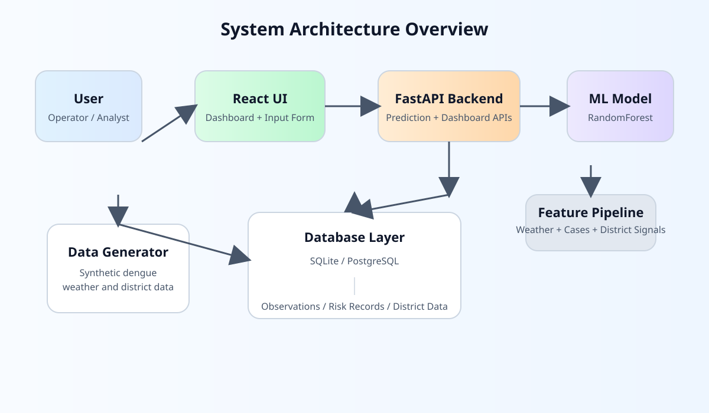
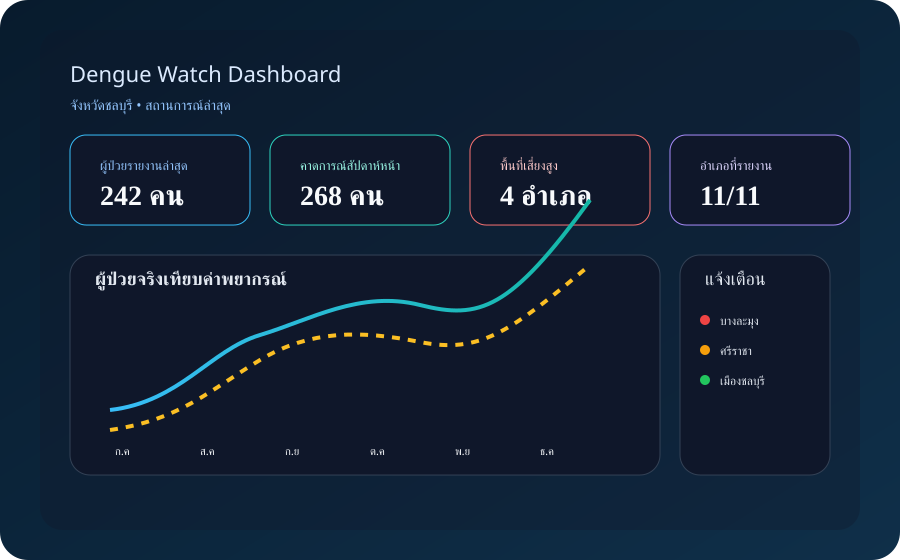
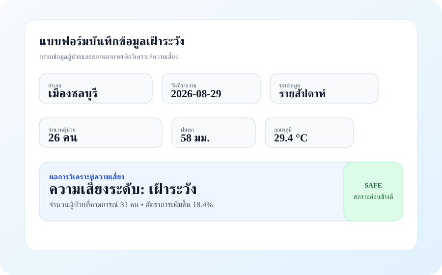

<div align="center">
  
</div>

# Senior Full-Stack Developer / Data Scientist Portfolio

<p align="center">
  <strong>Full-Stack • Data Science • Dashboard • AI Prototyping</strong>
</p>

<p align="center">
  โปรเจคนี้สะท้อนความสามารถในการสร้างระบบ end-to-end จากข้อมูล การวิเคราะห์ การพยากรณ์ ไปจนถึงการแสดงผลบน Dashboard
  ที่พร้อมสำหรับนำเสนอผลงานในเชิงธุรกิจ งานวิจัย และการสาธิตความสามารถทางเทคนิค
</p>

## Portfolio Summary

<div align="center">
  <table>
    <tr>
      <td width="33%">
        
      </td>
      <td width="33%">
        
      </td>
      <td width="33%">
        
      </td>
    </tr>
  </table>
</div>

### Highlights

- Backend Engineering: FastAPI, REST API, validation, และ data service architecture
- Frontend Development: React, Vite, interactive UI, dashboard flow
- Data Science: feature design, synthetic data generation, machine learning forecasting
- Database Integration: PostgreSQL และ SQLite
- Product Presentation: โครงสร้างโปรเจคที่จัดระเบียบและมีภาพประกอบชัดเจน

## Featured Projects

### 1) Chonburi Dengue Watch
- ระบบเฝ้าระวังและพยากรณ์โรคไข้เลือดออกในจังหวัดชลบุรี
- ผสาน FastAPI, React, SQLite และ ML workflow
- เหมาะสำหรับการสาธิตการทำงานแบบ end-to-end และผลงานเชิงวิชาการ

### 2) PostgreSQL + FastAPI
- ตัวอย่าง API ที่เชื่อมต่อ PostgreSQL อย่างมีโครงสร้าง
- สะท้อนความสามารถด้าน database integration และ backend architecture

### 3) React Dashboard District Filter
- Dashboard สำหรับการกรองข้อมูลรายอำเภอและสรุปสถานการณ์แบบชัดเจน
- เหมาะสำหรับการนำเสนอข้อมูลเชิงพื้นที่และการแสดงแนวโน้ม

## Tech Stack

- Python / FastAPI / SQLAlchemy
- React / Vite / Recharts
- PostgreSQL / SQLite
- Machine Learning / Random Forest
- Docker Compose / API Design

## Presentation Page

อ่านโครงการในรูปแบบ landing page แบบสั้น ๆ ได้ที่:

- [docs/portfolio-landing.html](docs/portfolio-landing.html)

## Quick Start

### 1) Clone Repository

```bash
git clone https://github.com/prapan34-hue/senior-full-stack-developer-data-scientist.git
cd senior-full-stack-developer-data-scientist
```

### 2) Run Chonburi Dengue Watch

```powershell
cd chonburi-dengue-watch/backend
python -m venv .venv
.\.venv\Scripts\Activate.ps1
pip install -r requirements.txt
python -m app.ml.train
uvicorn app.main:app --reload --port 8000
```

```powershell
cd ../frontend
pnpm install
pnpm dev
```

### 3) Run PostgreSQL Sample

```powershell
cd ../postgresql-fastapi/postgresql
python -m venv .venv
.\.venv\Scripts\Activate.ps1
pip install -r requirements.txt
Copy-Item .env.example .env
docker compose up -d
uvicorn app.main:app --reload --port 8000
```

## Important Note

ข้อมูลในโครงการหลักเป็นข้อมูลจำลองเพื่อการสาธิต การทดลอง และการนำเสนอเท่านั้น
ไม่ควรใช้เป็นฐานข้อมูลเชิงปฏิบัติจริงสำหรับการตัดสินใจทางสุขภาพหรือสาธารณสุขโดยตรง หากต้องใช้งานจริงควรมีข้อมูลจริง การตรวจสอบทางวิชาการ และการร่วมมือกับผู้เชี่ยวชาญที่เกี่ยวข้อง

## Final Summary

Repository นี้แสดงให้เห็นถึงความสามารถต่อเนื่องใน 4 ด้านสำคัญ:

- Backend Engineering
- Frontend Development
- Data Science / ML
- Product Presentation

ซึ่งเหมาะอย่างยิ่งสำหรับใช้เป็น portfolio project ในการสมัครงาน การแสดงผลงาน หรือการนำเสนอให้กับผู้ชม
